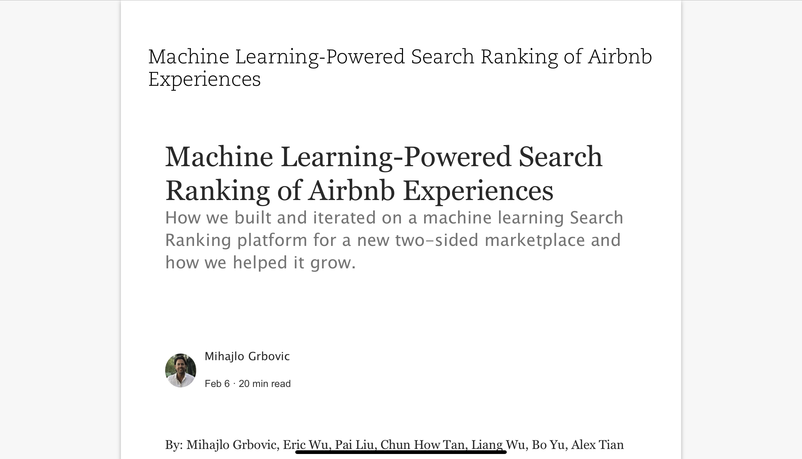
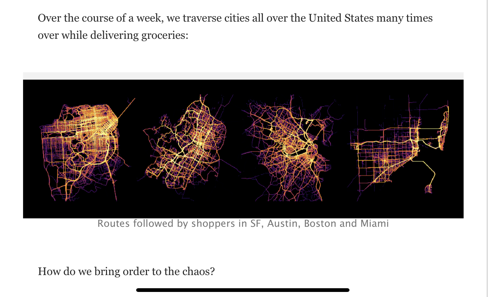

# 机器学习系统设计

# 导读

## 机器学习系统设计

系统设计题，顾名思义，就是考察一个人设计系统的能力。它是一种国外很喜欢的题型，特别是中高级职位，在算法手撕结束后，一般就是系统设计题。

国外的算法工程师，被称之为 Machine Learning Engineer。国内的名头比较多，算法工程师、数据挖掘工程师、机器学习工程师、深度学习工程师都指的这个。

这一岗位同开发岗位，SDE 一样，也需要足够的系统设计经验。

国外的大佬 github.com/chiphuyen 总结了一份机器学习设计的资料，我在这里做本地化整理，同时增加一些自己的从业体会。

内容分为3个部分，分别是：

- 机器学习的系统设计部分，这里做了核心概念的摘录；
- 系统设计的案例，由于众所周知的原因，很多文章看不了，我这里将其整理放入了 github，同时笔记标注版的放在了公众号：谷粒说数。
- 练习部分，作者列了27道系统设计题。我这里将其布置在了网页上，方便自查，后续会上评论进行答案收集。

### 系统设计应关注的点

系统设计题，如果没有完整的方案也没关系，主要看表现的思想，着重从以下三个方面考察：

1. 项目有哪些约束条件，哪些能做，哪些不能做。
2. 方案的利弊，选择方案时，思考方案利弊的过程。
3. 主要的功能，最后达成什么样的效果。

系统设计往往很难，这是因为两方面的原因。1. 缺乏有效的评估手段。2. 问题往往模棱两可。面试中的理想候选人应该是这样子的：1. 能够有效的拆解问题，将复杂问题简单化。2. 能够区分该场景是否需要机器学习方案。第二点很重要，因为在当下，受媒体大环境影响，很多人会选择无脑上机器学习，殊不知某些场景简单的方法更有效。

> Machine learning methods change every year, solving problems stays the same.

## 生产环境不同于学术环境

学术研究的一般有以下两个特点：

1. 想法设法比上一代模型效果更好，而不用思考怎么落地使用它。
2. 由于效果是第一要务，所以算力没有限制，加钱堆机器即可。

而生产环境不同，它的特点如下：

- 效果并非越好才好
- 算力资源常常有限

作为开发者，要始终牢记生产环境是我们的目标。

## 需着重关注的4类问题

1. 如何采集数据、如何处理数据。
2. 怎么选择的模型、为什么。
3. 如何评估你的模型。
4. 如果再来一次，哪些地方会做得不一样。

# 设计机器学习系统

系统设计方面，作者将其分为了4个层次，我这里也按她的逻辑进行。

## 项目准备

项目准备阶段，一般从三个角度思考。如同写程序一样，首先思考需要达成什么样的目标；其次是有哪些限制条件；最后是特殊例子的考虑。

展开来讲，需要达成什么样的目标：即最后用户怎么使用你的系统，你的系统吞吐多块、响应多快。

项目的限制条件包括：项目周期多长，有多少算力，需要何种能力，有哪些可用资源。

特殊例子即：是否需要结合用户做特殊化处理，例如千人千面。

最后，如同老师设计考试一样，需要考虑如何评估你的系统性能。

## 数据流

> Machine learning is driven more by data than by algorithms

数据这里主要涉及数据的采集、存储和处理。

对于数据的采集，需考虑数据的可获得性和数据的质量。换句话说即，有哪些数据、数据的质量如何、还有哪些数据可以获取到。

数据存储问题需考虑：数据现在存在哪里、每个样本有多大、需要什么样的数据结构进行存储。

存储之后是数据处理，这一块原文的问题都很好，建议细读。抛出了以下问题：如何将原始数据转化为需要的数据、需要做特征工程吗、需要归一化吗、如何处理缺失数据等。

最后是两个值得从业者都重视的问题：用户隐私和系统偏差。

系统需要反馈，则不可避免需要收集用户数据。这里需思考哪些数据可以收集、哪些数据需要用户的同意，以及采用何种形式收集。

而对于系统性的偏差，一个成语来形容：管中窥豹。如果你的系统是那根管子，你看到的就会是带有偏差的东西。需要时刻提防系统偏差带来的偏见，防止模型放大这种偏见。

## 建模

建模对于熟悉各类算法竞赛的人来说，问题不大。但还是需要强调，生产环境不同于竞赛或学术。模型选择上，简单模型优先。

简单模型有如下好处：

- 逐渐增加负责度，有利于调试
- 作为 baseline，方便判断模型好坏

选择一个好的 baseline，可以帮助判断问题是否适合上模型。baseline 设置有如下三种方法：

- 随机 baseline
- 专家 baseline
- 简单的统计 baseline

最后需要强调的是，深度学习并非万能，非深度学习方法也很管用。比起深度学习需要的大量数据，你可能更需要的是早期的用户。

> Deep learning needs data，you might first need users.

### 模型的 debug

不收敛、过拟合、权重大幅波动

##### 常见可能

- 理论局限
- 错误的假设前提
- 复杂模型
- 拼写错误
- 超参数不合适
- 数据问题

##### 调试的几个建议

- 逐渐增加复杂度
  - 刚开始简单一些，用简单模型验证模型
- 在小批次数据上过拟合
  - 以此验证模型的极限，观察模型是否适合该问题
- 设置随机种子
  - 保持结果能够复现

## 服务部署

模型走到最后一步，就是 Serving。这里我将其翻译为服务部署。类似的文章我也写过，主要是技术层面，可参考：[https://kuhungio.me/2019/flask_vue_ml/](https://kuhungio.me/2019/flask_vue_ml/?utm_source=website&utm_campaign=ml_sys_design)

这里从逻辑层面讲述，主要分为两个部分，以交付用户为分割点。

交付用户前：从用户收集何种反馈，如何判断模型是否正常。

交付用户后：

- 是否需要拟合最新的反馈结果
- 是否需要个性化服务
- 多久更新一次模型

最后是一些其他问题，诸如：业务是否需要模型的可解释性，潜在的数据偏差是否误导了模型等。

> All models are wrong, but some are useful.

------

# 10个经典案例学习

作者罗列了10个精彩案例，知名企业的机器学习系统设计文章。但由于一些技术原因，部分内容加载缓慢或无法加载。我这里将其转成 pdf 同步到了我的 Github 上，笔记标注版放在了我的公众号--谷粒说数上，欢迎大家捧场。

就内容而言，简单点评一下：

读后收获最大的是第五篇文章，讲 Airbnb 搜索排序的迭代过程。该文详细描述了初始版到线上版的迭代过程，辅以详细的特征手法和数据说明。同时也是很好的 CTR 点击率转化教程。其他的不读都可以，这篇强烈建议阅读。

做得最好看得要数第七篇文章，instacart 公司在配送货物过程中，利用可视化辅助算法决策。

更多得精彩，有待各位去发现啦。

案例地址：<https://github.com/kuhung/machine-learning-systems-design/tree/master/pdf>

笔记标注版：关注公众号【谷粒说数】，陆续放出。

------

# 27道练习题

俗话说，学而不思则殆。作者也总结了27道系统设计的练习题，但感觉没有网页看着爽，于是便捣鼓上线了网站，后续将引入评论功能，欢迎贡献答案。合适的答案将整理署名后，反馈给原作者。

练习网站：[https://kuhungio.me/machine-learning-systems-design/](https://kuhungio.me/machine-learning-systems-design/?utm_source=website&utm_campaign=ml_sys_design)

------

不知道对于机器学习系统设计，你有什么想法呢？欢迎在屏幕下方留言。

喜欢我的朋友，别忘了点赞 👍、喜欢 ❤ +关注 🔔哦，你的鼓励是对我最大的支持~💪
[关于我](/about/) 

# 参考资料

* [chiphuyen/machine-learning-systems-design][machine-learning-systems-design]
* [kuhung/dsqa][dsqa]

---

欢迎关注我的社会媒体账号，接收更多好玩的东西。

[dsqa]: https://github.com/kuhung/dsqa
[machine-learning-systems-design]:https://github.com/chiphuyen/machine-learning-systems-design